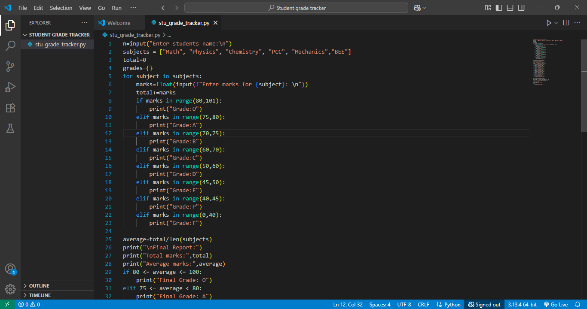

# 🧮 Student Grade Tracker

📊 A simple Python program that takes a student's subject marks, assigns grades, calculates averages, and gives personalized feedback.

---

## 📌 Overview

This project is designed for quick evaluation of a student's academic performance. It:

- ✅ Accepts marks for **6 subjects**
- 📝 Displays **subject-wise grades**
- 🧮 Calculates **average**, **percentage**, and **final grade**
- 🔍 Includes **pass/fail status** and **remarks**
- 💻 Displays output directly in the terminal

---

## ✨ Features

- 🔢 Input validation for marks (0-100)
- 📊 Subject-wise and final grade display
- 🎯 Final percentage and average calculation
- 💬 Grade-based performance remarks
- 🖼️ Organized project folder with screenshots

---

## 📸 Screenshots

*Primary code implementation*

.png)
*Additional program logic*

*Example grade calculation results*